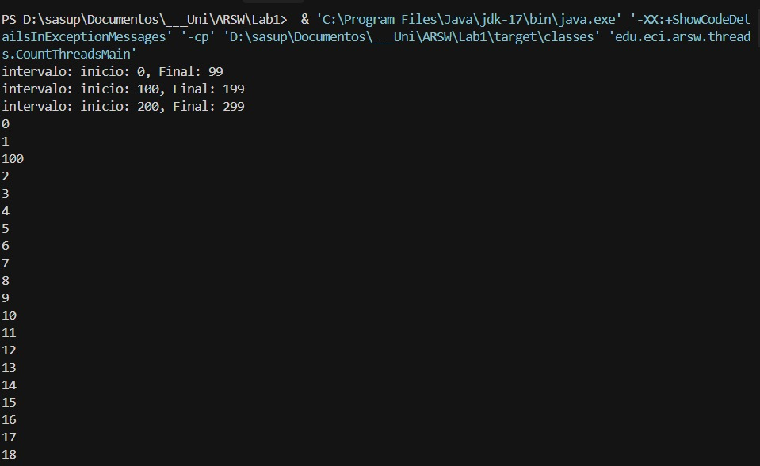
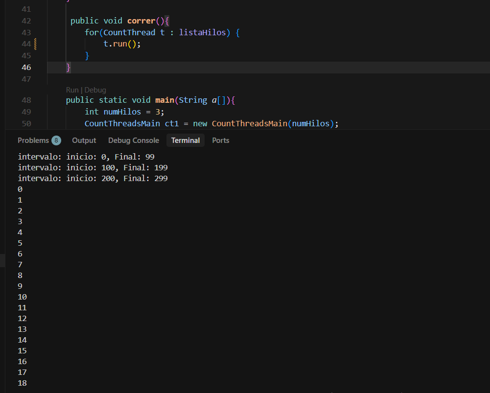
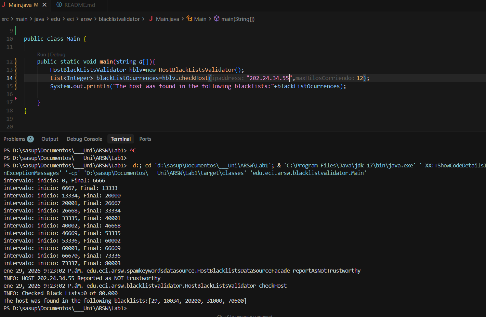
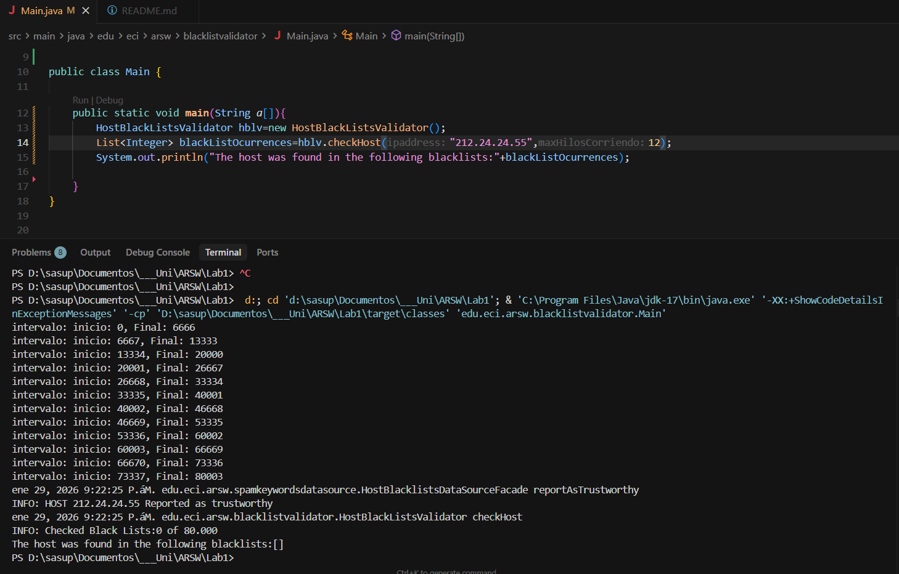
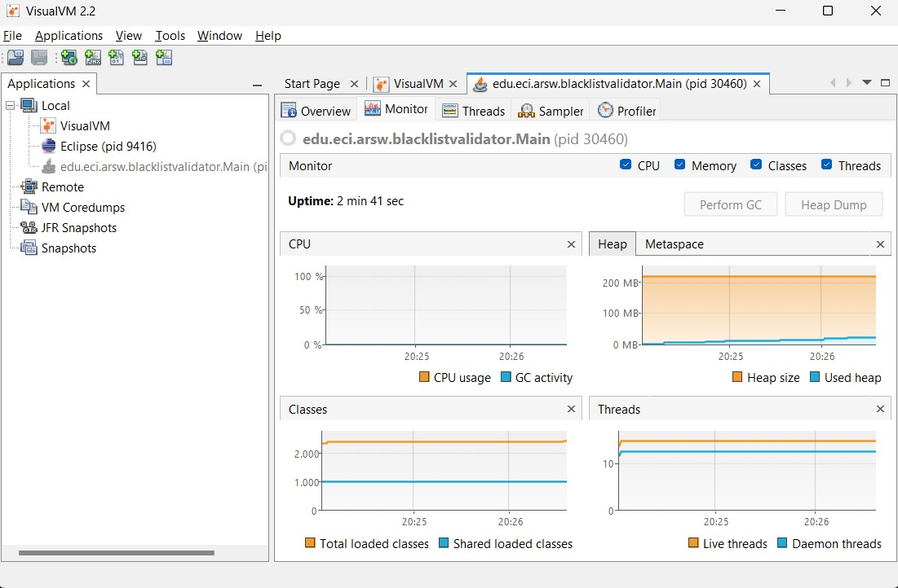
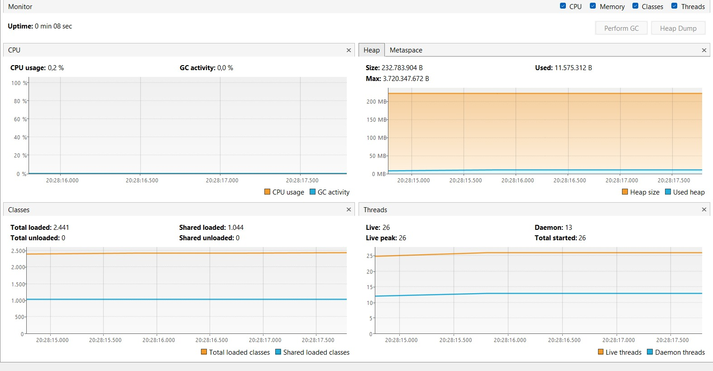
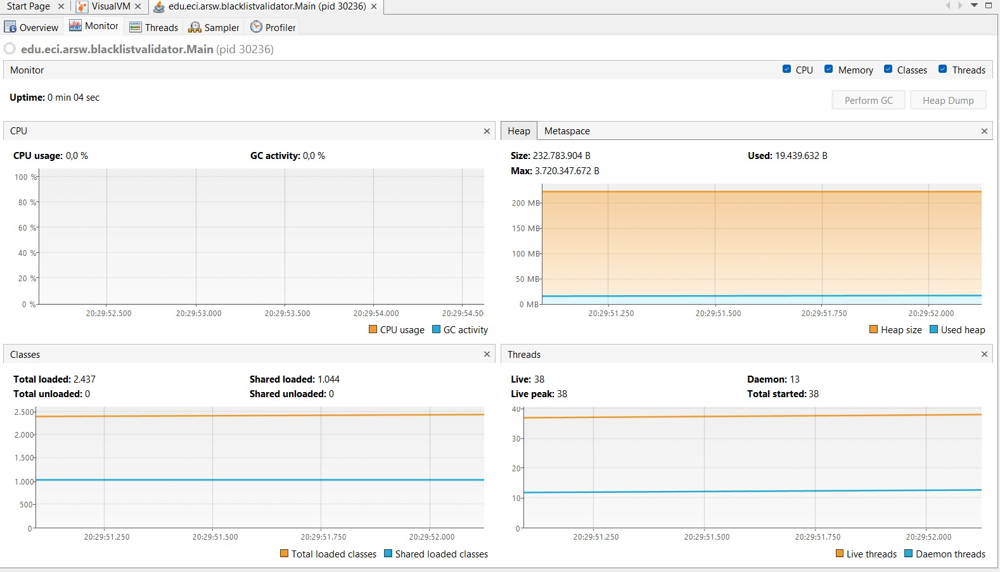
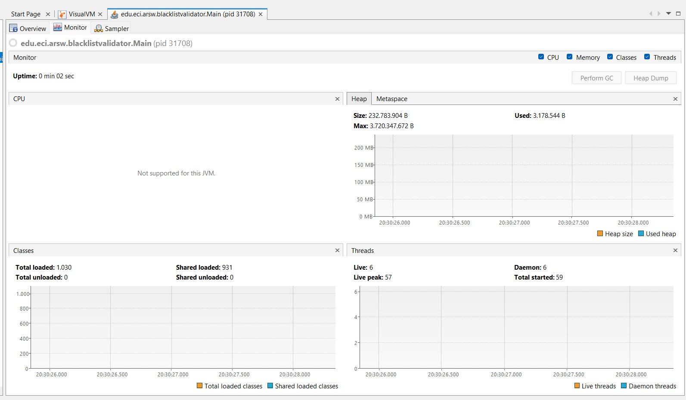
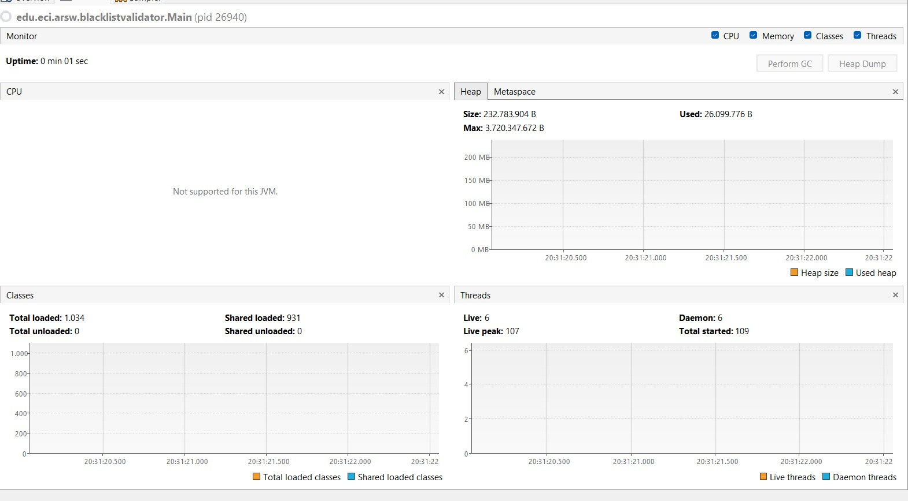
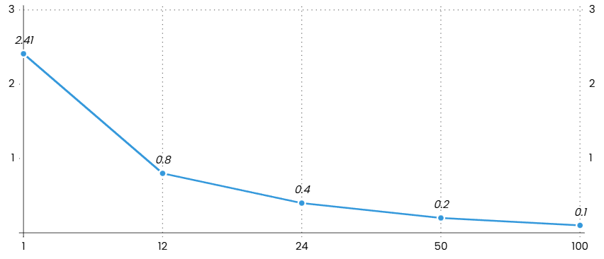

### Escuela Colombiana de Ingeniería
### Arquitecturas de Software - ARSW

**Juan Felipe Rangel & Santiago Suarez**

## Ejercicio Introducción al paralelismo - Hilos - Caso BlackListSearch


## Parte I - Introducción a Hilos en Java

Durante este ejercicio se realizo la definicion e implementacion de hilos basicos con la funcion de imprimir numeros en intervalos definidos.
Para esto se utilizaron los metodos run() y start() y se verifico el funcionamiento de los hilos con ambos metodos.

Con start se ejecuta paralelamente 


Con run secuencialmente



## Parte II - Ejercicio Black List Search 

La implementación utiliza programación concurrente con hilos para paralelizar la búsqueda de direcciones IP en múltiples listas negras. La solución se compone de dos clases principales:

#### 1. **Clase `serverSearch` (Thread)**
Esta clase extiende de `Thread` y representa un hilo de ejecución que busca una dirección IP en un segmento específico de servidores de listas negras.

**Responsabilidades:**
- Buscar una IP en un rango asignado de servidores (desde `inicio` hasta `fin`)
- Mantener el conteo de ocurrencias encontradas
- Almacenar los números de las listas negras donde se encontró la IP
- Ejecutar la búsqueda en paralelo con otros hilos

**Métodos principales:**
- `setNumeros(int inicio, int fin)`: Define el rango de servidores a buscar
- `run()`: Ejecuta la búsqueda en el rango asignado
- `ocurrenciasEncontradas()`: Retorna el número de ocurrencias encontradas
- `listasEncontradas()`: Retorna la lista de IDs de listas negras donde se encontró la IP

#### 2. **Clase `HostBlackListsValidator`**
Clase coordinadora que gestiona la creación, distribución y sincronización de los hilos de búsqueda.

**Método `checkHost(String ipaddress, int maxHilosCorriendo)`:**

Este método implementa la estrategia de paralelización mediante los siguientes pasos:

1. **Inicialización:**
   ```java
   - Obtiene el número total de servidores disponibles
   - Crea una lista para almacenar las ocurrencias encontradas
   - Obtiene la instancia de HostBlacklistsDataSourceFacade
2. **Creación y distribución de hilos:**
   - Crea `maxHilosCorriendo` instancias de `serverSearch`, cada una con la IP a verificar
   - Utiliza el método `dividirValores()` para distribuir equitativamente el rango de servidores entre los hilos, asignando a cada `serverSearch` un intervalo específico mediante `setNumeros()`

3. **Ejecución paralela:**
   - Inicia todos los hilos con `start()` para que ejecuten la búsqueda simultáneamente
   - Utiliza `join()` para esperar a que todos los hilos terminen antes de continuar

4. **Recopilación de resultados:**
   - Consolida los resultados de todos los hilos, sumando las ocurrencias encontradas y agregando las listas negras detectadas
   - Evalúa si el total de ocurrencias alcanza el umbral `BLACK_LIST_ALARM_COUNT` para determinar si la IP es confiable o no

202.24.34.55 reportado en listas negras



212.24.24.55 No reportado en listas negras


## Parte II.I 

**La estrategia de paralelismo antes implementada es ineficiente en ciertos casos, pues la búsqueda se sigue realizando aún cuando los N hilos (en su conjunto) ya hayan encontrado el número mínimo de ocurrencias requeridas para reportar al servidor como malicioso. Cómo se podría modificar la implementación para minimizar el número de consultas en estos casos?, qué elemento nuevo traería esto al problema?**

una forma para evitar que los hilos sigan realizando la busqueda aun cuando ya hayan encontrado la ip la cantidad de veces minima requerida para una clasificacion, puede ser la implementacion de una variable compartida para cada hilo en la que cada vez que un hilo encuentre la ip aumente la variable contadora hasta el punto del conteo minimo, en este caso todos los hilos deberian parar la busqueda.
para evitar la condicion carrera con la implementacion de esta variable se debe hacer un sistema de bloqueos y esperas (como synchronized) definiendola como la seccion critica.


**Parte III - Evaluación de Desempeño**

A partir de lo anterior, se implement la siguiente secuencia de experimentos para realizar 
las validación de direcciones IP dispersas, 
tomando los tiempos de ejecución de los mismos):

1. Un solo hilo.

2. Tantos hilos como núcleos de procesamientome (12 nucleos)

3. Tantos hilos como el doble de núcleos de procesamiento.

4. 50 hilos.

5. 100 hilos.

6. grafica.
   



**Parte IV - Ejercicio Black List Search**

1. Según la ley de Amdahls

donde _S(n)_ es el mejoramiento teórico del desempeño, _P_ la fracción paralelizable del algoritmo, y _n_ el número de hilos, a mayor _n_, mayor debería ser dicha mejora. Por qué el mejor desempeño no se logra con los 500 hilos?, cómo se compara este desempeño cuando se usan 200?. 

**respuesta** Aunque la ley de Amdahl dice que usar más hilos debería mejorar el rendimiento, en la práctica esto tiene un límite. El programa siempre tiene una parte que no se puede ejecutar en paralelo y, además, crear y manejar muchos hilos genera un costo extra. Por eso, al usar 500 hilos el sistema pierde tiempo organizándolos y no gana velocidad real. Con 200 hilos ocurre menos sobrecarga y el rendimiento es similar o incluso mejor que con 500.

2. Cómo se comporta la solución usando tantos hilos de procesamiento como núcleos comparado con el resultado de usar el doble de éste?.

**respuesta** Al usar tantos hilos como núcleos de procesamiento, cada hilo puede ejecutarse en un núcleo físico, logrando un paralelismo efectivo y un uso eficiente de la CPU. En cambio, al utilizar el doble de hilos que núcleos, los hilos comienzan a competir por los mismos recursos, aumentando el cambio de contexto y el overhead del sistema operativo, lo que hace que el rendimiento no mejore de forma apreciable e incluso pueda disminuir.

3. De acuerdo con lo anterior, si para este problema en lugar de 100 hilos en una sola CPU se pudiera usar 1 hilo en cada una de 100 máquinas hipotéticas, la ley de Amdahls se aplicaría mejor?. Si en lugar de esto se usaran c hilos en 100/c máquinas distribuidas (siendo c es el número de núcleos de dichas máquinas), se mejoraría?. Explique su respuesta.

**respuesta** Si en lugar de ejecutar 100 hilos en una sola CPU se utilizara un hilo en cada una de 100 máquinas distribuidas, la ley de Amdahl se aplicaría de manera más favorable, ya que cada hilo contaría con recursos dedicados y no existiría competencia por CPU dentro de una misma máquina. Esto permitiría un paralelismo más real y una mejor escalabilidad, logrando un mayor rendimiento que concentrar muchos hilos en un solo sistema.


